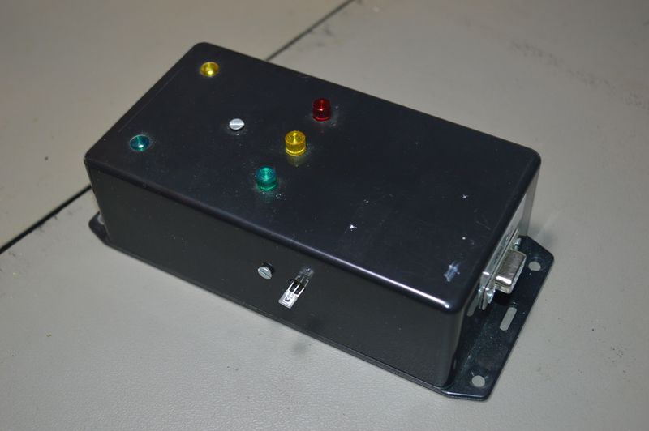

## Source code for project: [Temperature and light sensor with signalling LEDs (RS232)](https://link.stdout.no/p)

Temperature and light sensor, with signal LEDs and RS232 communication, uses an AVR ATmega8 microcontroller.

Written in basic, using [Bascom-AVR](http://www.mcselec.com/).

### Author
[Thomas Jensen](https://thomas.stdout.no)
